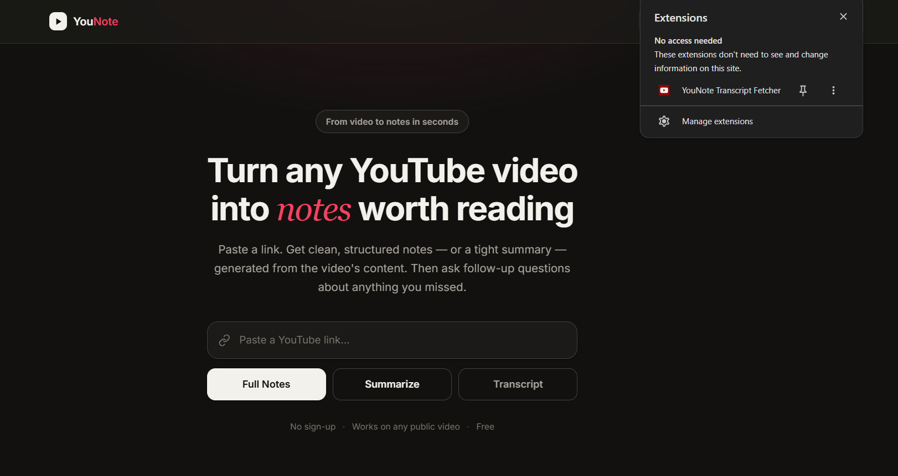
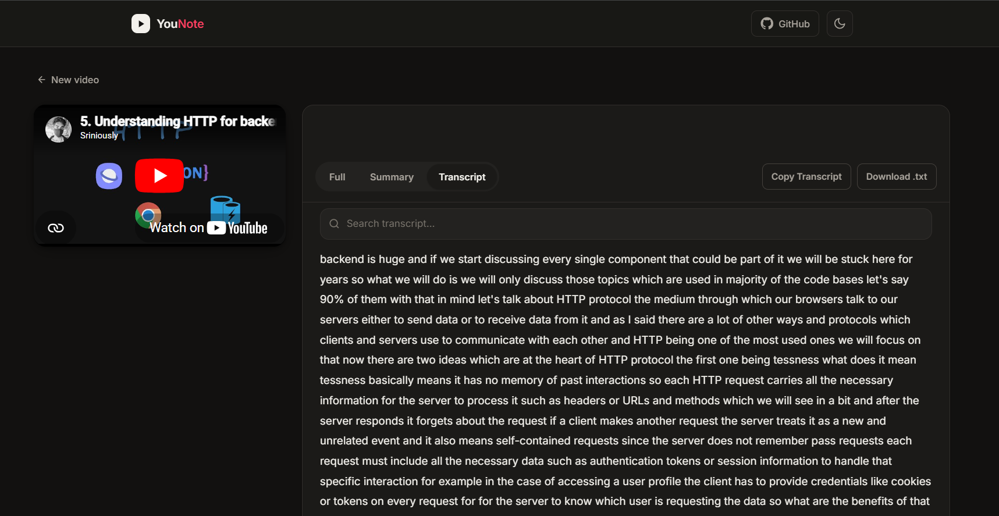
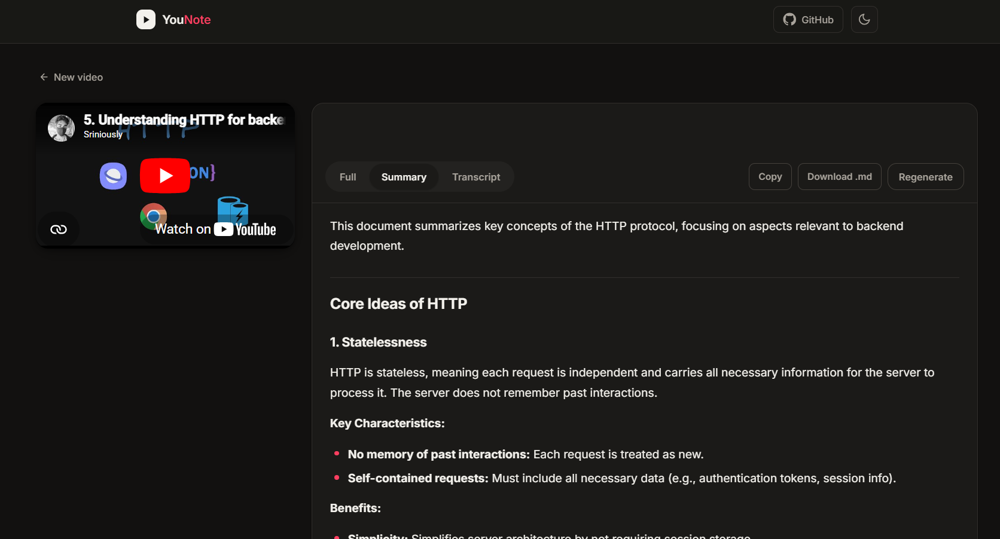
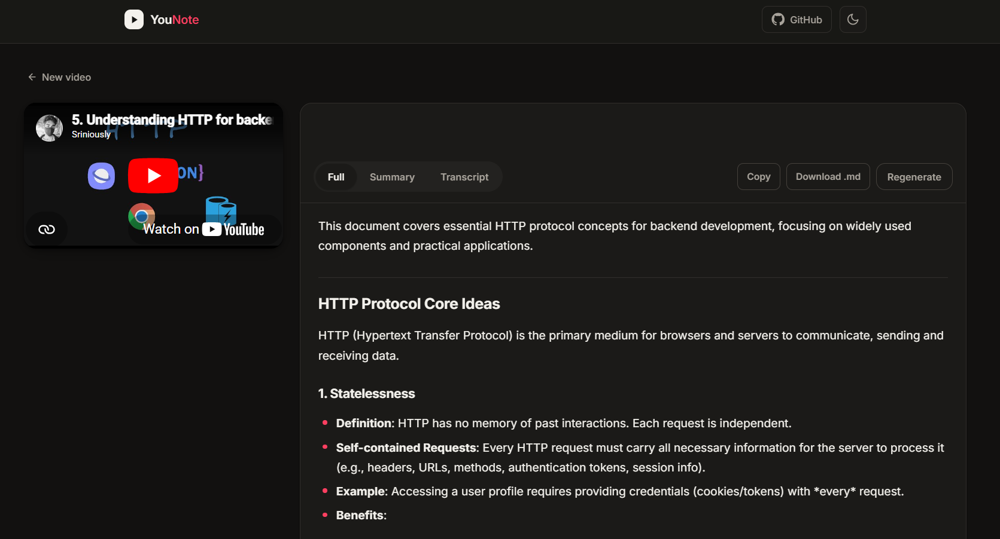
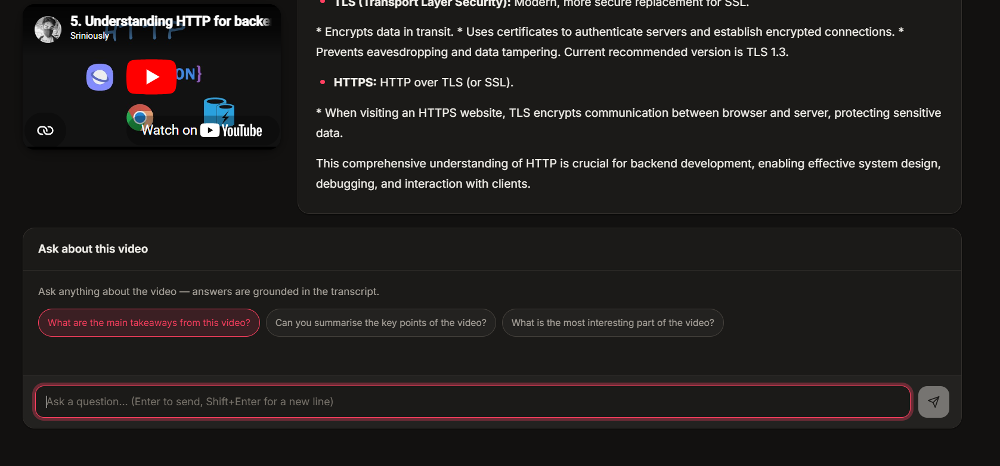
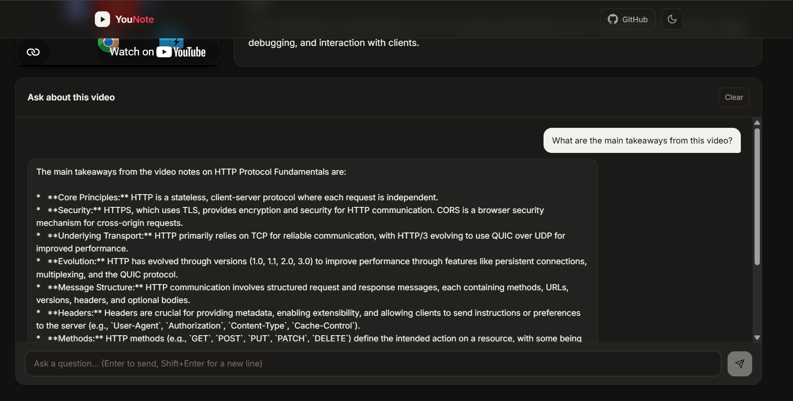
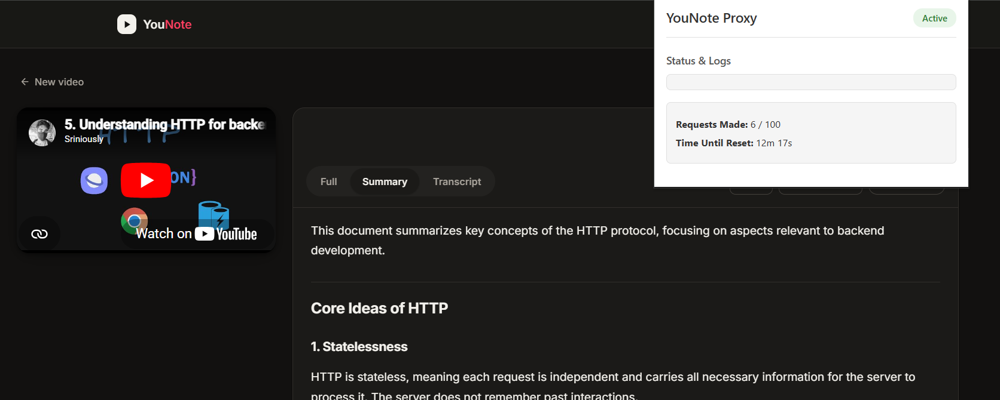

# YouNote

Turn any YouTube video into clean, AI-generated notes in seconds.

YouNote extracts a video's transcript, generates structured notes or summaries using AI, and lets you chat with the generated content—all through a clean, minimal interface.

---

## Features

- 🎥 Paste any YouTube video URL
- 📝 Generate detailed AI notes
- ⚡ Generate concise summaries
- 📄 View the original transcript
- 💬 Ask follow-up questions about the video
- 📋 Copy notes or transcript
- ⬇️ Download notes as Markdown and transcripts as text
- 🌙 Light & Dark mode
- 💾 Smart client-side caching to reduce unnecessary AI requests
- 📱 Fully responsive design

---

## Screenshots

<div align="center">
  
  
  
  
  
  
  
</div>

---

## Tech Stack

### Frontend

- React 19
- TypeScript
- Vite 7
- TanStack Start
- TanStack Router
- TanStack Query
- CSS Modules
- Tailwind CSS v4

### Backend

- Python 3
- FastAPI
- Gemini API
- YouTube Transcript API
- Pydantic

---

## Architecture

```text
             React Frontend
                    │
          ┌─────────┴─────────┐
          │                   │
          ▼                   ▼
      Extension         FastAPI Backend
          │                   │
          ▼                   ▼
       YouTube            Gemini API
    (Client IP)               │
          │                   │
          └─────────┬─────────┘
                    ▼
          AI Generated Response
```

---

## How It Works

1. Paste a YouTube video URL.
2. The frontend attempts to fetch the transcript directly from YouTube via the **Browser Extension** (using your local IP to avoid blocking).
3. If the extension is unavailable, it falls back to the backend fetching it server-side.
4. Depending on the selected mode:
   - **Transcript** → Return the raw transcript directly to the screen.
   - **Summary** → Send the transcript to Gemini for a concise summary.
   - **Full Notes** → Send the transcript to Gemini for structured notes.

5. The frontend displays the result and caches it for future visits.
6. Users can ask follow-up questions using the generated notes as context.

---

## Project Structure

```text
Extension/
├── manifest.json
├── popup.html
└── service-worker.js

Frontend/
├── src/
│   ├── components/
│   ├── hooks/
│   ├── lib/
│   ├── providers/
│   ├── routes/
│   └── styles/
│
Backend/
├── app/
│   ├── api/
│   ├── models/
│   ├── services/
│   ├── utils/
│   └── main.py
```

---

## Running Locally

### Clone

```bash
git clone https://github.com/<your-username>/YouNote.git
cd YouNote
```

### Backend

```bash
cd BackEnd

python -m venv .venv

# Windows
.venv\Scripts\activate

# Linux / macOS
source .venv/bin/activate

pip install -r requirements.txt

uvicorn app.main:app --reload
```

Create a `.env` file:

```env
PORT=8000
GEMINI_API_KEY=YOUR_API_KEY
MODEL=gemini-2.5-flash
ALLOWED_ORIGINS=http://localhost:3000
```

---

### Frontend

```bash
cd FrontEnd

npm install

npm run dev
```

Create a `.env` file:

```env
PORT=3000
VITE_API_URL=http://localhost:8000
VITE_APP_NAME=YouNote
VITE_EXTENSION_ID=your_extension_id_here
```

### Extension Setup

To avoid YouTube blocking the backend IP, load the included extension:

1. Open Chrome/Chromium to `chrome://extensions/`
2. Enable "Developer mode"
3. Click "Load unpacked" and select the `Extension` folder
4. Copy the Extension ID and paste it into your Frontend `.env` file as `VITE_EXTENSION_ID`

## Lessons Learned

Building YouNote involved working with:

- React Server-Side Rendering (SSR)
- Hydration and theme synchronization
- FastAPI backend development
- REST API design
- Gemini API integration
- YouTube transcript extraction
- Client-side caching with TanStack Query
- Responsive UI design
- TypeScript and modern React patterns

---

## License

This project is licensed under the MIT License.

---

## Author

**Ryan Hans**

If you found this project interesting, consider giving it a ⭐ on GitHub.
